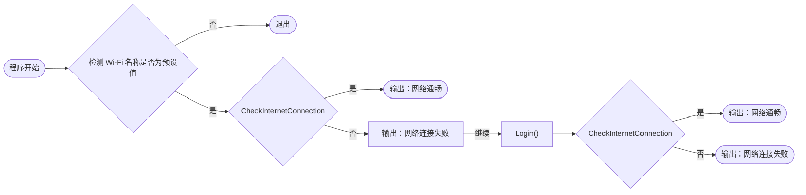

# SWPU Drcom Auto Login Python Script 西南石油大学Drcom认证自动登录脚本
> 本脚本仅供学习交流使用，编写目的仅为方便本人每次去图书馆登录 Wi-Fi，请遵守学校网络提供商规定，不得用于任何商业和非法用途，否则后果自负。
> 
> 本脚本基于Python3.7编写，使用了requests库，需要安装requests库
> 
> 作者：[LeonYew](https://leonyew.fun/)
# 简介 Introduction
一个 Python 小脚本，方便本人每次去图书馆登录 Wi-Fi，请遵守学校网络提供商规定，不得用于任何商业和非法用途，否则后果自负。

# 使用方法 Usage
安装 Python 3.7 及以上版本。

Python 官网：https://www.python.org/downloads/

安装 requests 库
```shell
pip install requests
```
**修改脚本中的用户名和密码**，运行脚本即可。

## 如果你还想继续打包成 exe
安装 pyinstaller
```shell
pip install pyinstaller
```
生成打包配置文件（若使用项目中提供的请跳过此步骤）
```shell
pyi-makespec -F -w AutoLoginSWPU.py
```
打包
```shell
pyinstaller AutoLoginSWPU.spec
```
到 dist 目录下找到 AutoLoginSWPU.exe 文件即可。

# 原理
采用 Request 方法，直接发送 GET 请求。

程序流程：


# 可尝试的其他方法
利用 WebDriver 模拟用户点击登录按钮。